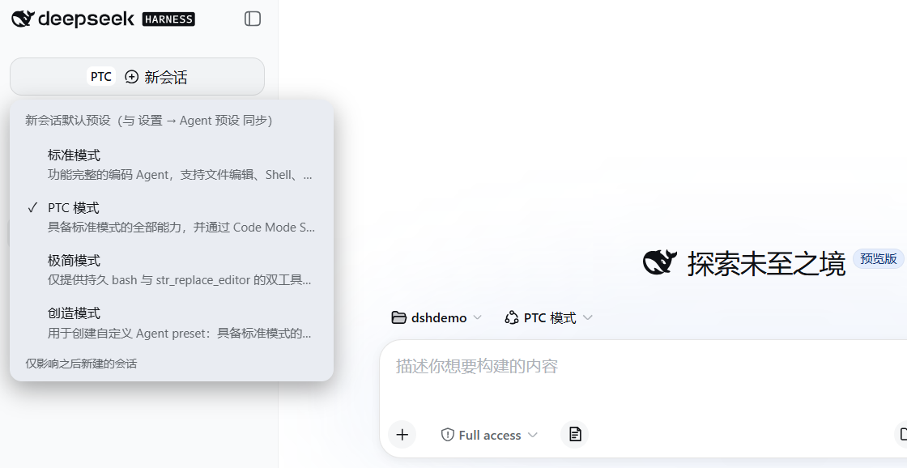

# dsh-sidebar-mode



把默认的四种模式（标准 / PTC / 创造 / 极简）切换**塞进「新会话」按钮里**：
点按钮最左边的小字就弹出预设菜单，即点即用——不用再进设置页切换，新会话创建更方便。

与**设置 → Agent 预设**双向同步：切换时会把新默认**立即应用到当前空白会话**，
新会话页的预设徽章实时翻转，无需再手动点徽章。

## 特性

- 无独立按钮、无三角：小字标签直接嵌在「新会话」按钮内，点击标签弹出菜单；
  点击按钮其他区域照常新建会话。
- 预设清单自动发现：菜单里除了出厂的标准 / PTC / 创造 / 极简四种模式，你自己
  复制或新建的预设（比如第五个自定义模式）也会自动出现在菜单里，随用随有，
  无需改插件；加载失败的预设会按官方规则自动排除。
- 预设名过长时，按钮内的小字标签自动截断成省略号，不会把「新会话」几个字挤掉；
  鼠标悬浮仍显示完整名称（和官方设置面板同一套截断策略）。
- 读写与官方设置面板同一数据通道（`agent-presets.default` + `agentPresets.select`），
  设置面板 / 侧边栏按钮 / 新会话页徽章三者一致。
- 跟随日间/夜间主题（全部使用 DSH 主题令牌）。
- 侧边栏收起成图标条时自动隐藏。
- 会话创建即固定预设是 DSH 的设计；本插件只改全局默认，并把新默认应用到
  当前空白会话，不影响已运行的会话。

## 安装（profile 插件，随 DSH 常驻）

```bash
cd "$(dsh home)/profiles/web"    # Windows: C:\Users\<you>\.dsh\profiles\web
pnpm add "github:Meredith2328/dsh-sidebar-mode"
```

并把 `dsh-sidebar-mode` 加入 `package.json` 的 `dsh.profile.bundles` 列表，
然后重启 DSH Desktop。

## 使用

- 点「新会话」按钮里最左侧的小字 → 弹出预设菜单（出厂四种 + 你自定义的所有
  预设，自动发现，当前项打 ✓）。
- 点选即切换：写入全局默认 + 应用到当前空白会话（若有）。
- 卸载：从 `dsh.profile.bundles` 移除并 `pnpm remove dsh-sidebar-mode`。

## 结构

- `lib/client.js` — 浏览器半（`__ModuleLoader__` 格式），全部逻辑在此。
- `lib/index.mjs` — Node 半，空 apply（纯 client 插件）。
- `cordis.patch.yml` — bundle patch：向组合插入本插件行。
